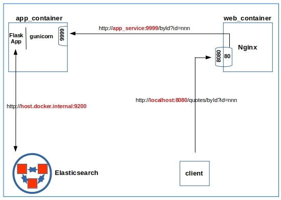

# A Serving Flask on Docker

Dockerizing a Flask web application behind gunicorn and Nginx

This is the source code to go along with the blog article

[A Serving Flask on Docker](http://xplordat.com/2020/03/13/a-serving-flask-on-docker/)

*Figure 1. The big picture. The web and app containers are brought up by docker-compose. Elasticsearch on the host is opened up for access from the docker network. The app service is accessed via the web container that proxies the request to app container*

##  The app

It is simple. Just return a random quotation from an Elasticsearch index, for a query like:

http://localhost:8080/quotes/byId?id=nnn

where nnn is an integer ID of the document, return a templated html snippet that renders as in:

##	To reproduce the results

	1. Install docker and docker-compose
	2. Clone the repo
	3. Have a data store (Elasticsearch used here, but a DB or a filesystem would do with minor changes to *quotes.py* module) with some quotes
	4. cd quoteserver
	5. docker-compose up
	6. Verify functionality
	7. docker-compose down

